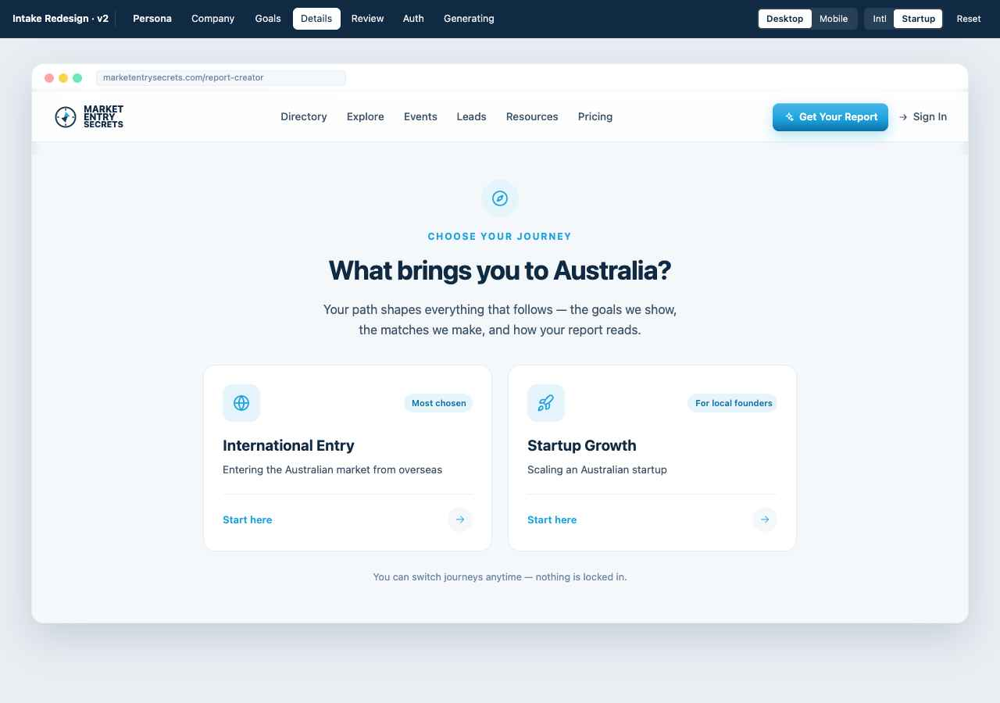
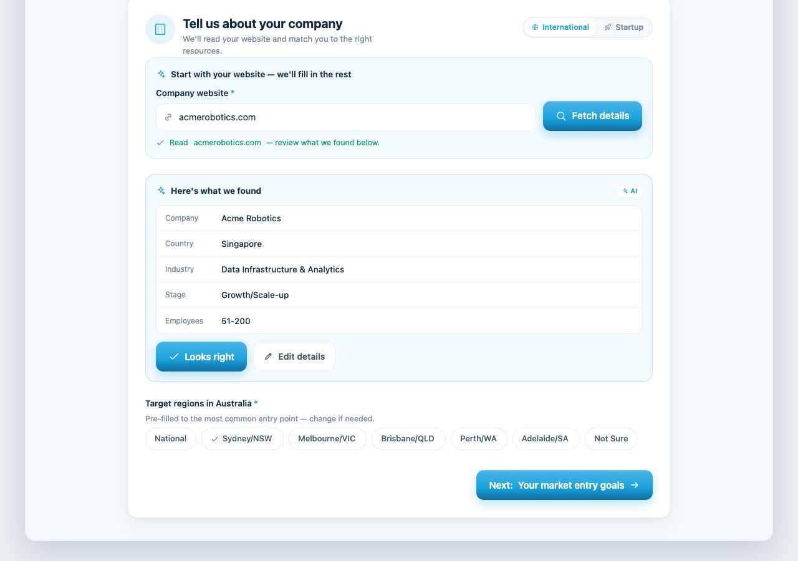
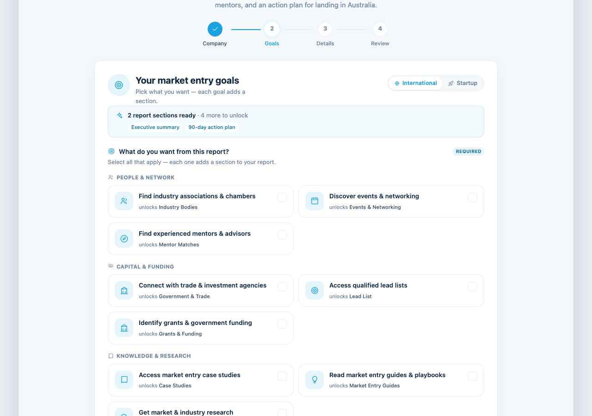
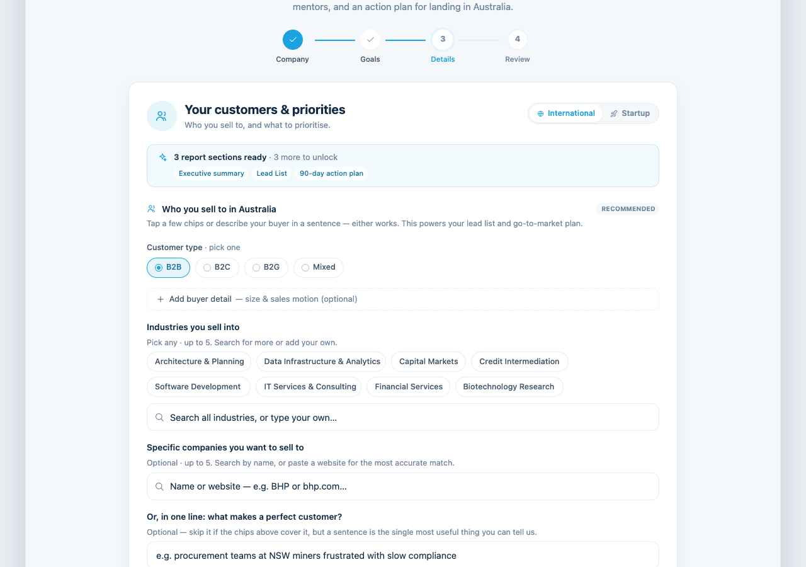
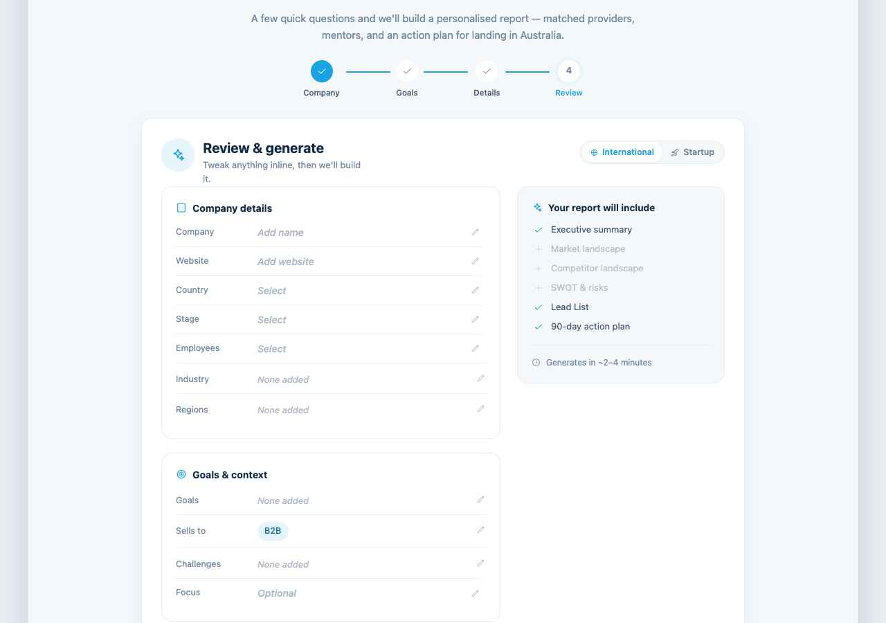
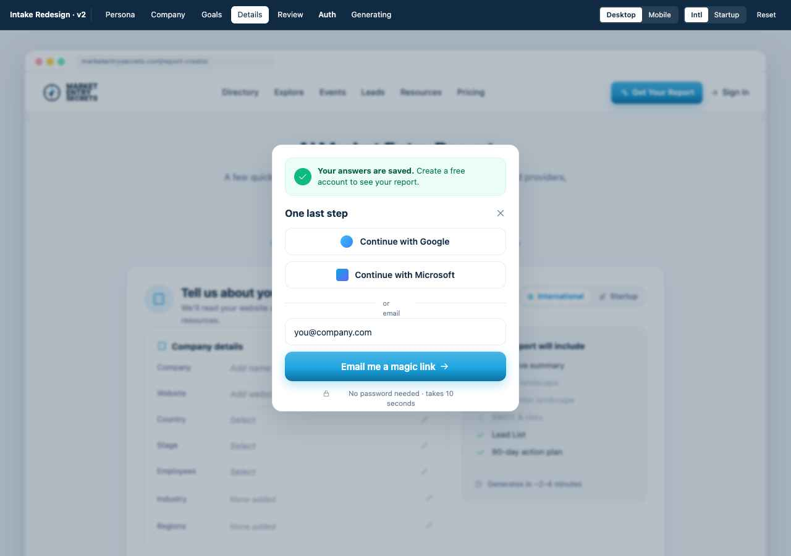

# Handoff: Market Entry Report Intake — Redesign v2

## Overview

A redesign of the `/report-creator` intake wizard in **`steviem101/market-entry-secrets`**. The
flow gathers a company profile, goals, customer profile, and priorities, then triggers a 2–4
minute AI pipeline (`supabase/functions/generate-report`) that produces a tiered, citation-backed
Australian market-entry (or startup-growth) report.

The redesign exists to fix measured drop-off in the current 3-step wizard (n=59 intakes):

- `target_customer_description` textarea: **27%** completion — now a structured chip profile.
- `additional_notes` textarea: **34%** completion, mean 16 chars — now one prompted question.
- Auth fired **after** "Generate" → 16/59 intakes stuck `pending` — auth now precedes generation.
- Startup persona effectively undiscoverable (URL-param only) → now a first-class entry choice.

## About the design files

The files in this bundle are **design references created in HTML/React-via-Babel** — a clickable
prototype showing the intended look and behaviour. **They are not production code to copy.** The
task is to **recreate these designs in the existing app** (Vite + React 18 + TypeScript + Tailwind
+ shadcn/ui + Supabase), reusing its established patterns — `react-hook-form` + `zod`, shadcn
primitives (`Select`, `Input`, `Card`, `Button`, `Badge`), `lucide-react` icons, and the existing
`AuthDialog`, `useReportGeneration`, and `intakeSchema` modules.

| File | What it is |
|---|---|
| **`START_HERE.md`** | **Claude Code's entry point** — read order, phased PR plan, acceptance criteria, guardrails. Begin here. |
| `HOW_TO_ADD_TO_GITHUB.md` | How to commit this package into your repo and point Claude Code at it. |
| `README.md` | This file — the full design spec (screens, layout, interactions, state, tokens). |
| `Report Intake Redesign (self-contained).html` | The full clickable prototype, bundled to one file. Open in a browser. **Needs internet** (Tailwind Play CDN + Google Fonts are not inlined). |
| `Intake v2 - Field Mapping.html` | The field → DB column → report-section spec. Open in a browser. |
| `ENGINEERING_TODO.md` | Prioritised, repo-specific engineering tasks (incl. a real shim bug to fix). |
| `reference_src/` | The prototype's React source, split by screen. Read for exact markup/logic; do not ship. |

> The prototype's top **dark control bar** (viewport / persona / screen jumper / Reset) and the
> **Tweaks panel** (accent, typeface, card style, density, persona A/B) are **prototype tooling for
> design review only** — do **not** build them into the product.

## Screens (visual reference)

Static captures of the key states. Open `Report Intake Redesign (self-contained).html` for the live,
clickable version — it's the source of truth.

| | |
|---|---|
| **Persona pick** (entry)  | **Step 1 — Company** (scrape → confirm card)  |
| **Step 2 — Goals** (cards + live preview bar)  | **Step 3 — Details** (B2B default, skippable detail, pickers)  |
| **Review** (inline-edit + preview rail)  | **Auth** (before generate, "answers saved")  |

## Fidelity

**High-fidelity.** Colours, typography, spacing, copy, and interactions are final. Recreate the UI
faithfully using the codebase's shadcn/Tailwind primitives. Map the prototype's raw values to your
`tailwind.config.ts` / `src/index.css` tokens rather than hard-coding hex.

---

## The flow (screens / views)

Entry → **Step 1** → **Step 2** → **Step 3** → **Review** → **Auth** → **Generating**. The numbered
stepper shows **Company · Goals · Details · Review** (4 nodes). Persona selection is an un-numbered
entry; Auth is a modal, not a step.

Target schema: **`docs/redesign/intakeSchema.v2.draft.ts`** (on PR #197). Each screen below maps to
its step schema (`step0/1/2` + the `targetCustomerSchema` / `challengeSchema` objects).

### 0. Persona pick (entry)
- **Purpose:** route tone, goal list, and every Perplexity query; make the Startup path discoverable.
- **Layout:** centred, max-width ~760px. Compass icon badge, eyebrow "CHOOSE YOUR JOURNEY", H1
  "What brings you to Australia?", sub. Two cards in a 2-col grid (1-col mobile).
- **Card:** white, `rounded-2xl`, 1px `--line`, padding 24px. Top row = pale-blue icon badge (globe
  / rocket) + ink "Most chosen" / "For local founders" pill. Title (19px/700), sub (13.5px/`--body`).
  Divider, then "Start here" (primary) + circular arrow. Hover: border → `--primary`, shadow `pop`,
  badge fills primary. **International is visually primary** (it's ~98% of traffic) but both are one tap.
- **Writes:** `persona: 'international' | 'startup'`. Persists as a top-right segmented toggle on
  later steps (switching it resets `goal_ids` to that persona's defaults).
- **A/B note:** the prototype's Tweaks panel can swap this for an *inline* persona chooser at the top
  of Step 1 (no entry screen). Default/recommended is the full-screen pick.

### 1. Company — website-first (`step1Schema`)
- **Purpose:** capture firmographics with minimum typing via a website scrape.
- **Layout:** inside the step card. A pale `--sky-tint` block at top holds **Company website** (URL
  input, link icon) + **Fetch details** primary button. Below, a 2-col grid (1-col mobile): Company
  name, Country of origin (Select), Company stage (Select), Number of employees (Select). Then
  **Industry / sector** (chips, top-10 shown first + "More (N)" expander, **plus a search field over
  the full ~152-item LinkedIn taxonomy and an "Add '{x}' as a custom industry" free-text fallback** —
  no company is ever stuck off-list; selected off-list/custom values always render as removable chips),
  max 3, then
  **Target regions in Australia** (chip multiselect) — *promoted above the fold* because it drives
  all DB matching yet 10% skip it today.
- **Scrape interaction (`scrapeState`):** `idle → loading → detected | error`.
  - On URL blur or **Fetch details**: show inline "Reading {url}… we only read public pages" with a
    spinner; **never block Next**.
  - On success: prefill country / industry / stage / employees, each marked with a small **"AI"** pill
    (`website_scrape_accepted: true`). On the **happy path the filled fields collapse into a single
    "Here's what we found" confirm card** (summary rows + an "AI" tag) with one **Looks right** button;
    **Edit details** expands the full editable field grid. This turns ~5 field confirmations into one tap.
  - **Target regions** are pre-filled to the most likely AU entry point (Sydney/NSW by default, or the
    scraped HQ) as a pre-checked chip with the hint "Pre-filled to the most common entry point — change
    if needed" — so the majority confirm rather than cold-pick. (`_regionSuggested` clears on any manual change.)
  - On failure/timeout: silent fallback — amber "Couldn't auto-read that site — just fill in below."
  - Debounce + cache: scrape each URL once, not per keystroke.
- **Validation:** website_url (valid URL), company_name, country_of_origin, industry_sector (≥1),
  company_stage, target_regions (≥1) required. Inline errors under each field.

### 2. Goals (`step2Schema.goal_ids`)
- **Purpose:** pick report focus; keep this step short.
- **Layout:** a **live preview bar** at top (see Interactions), then **goal cards** grouped under quiet
  category labels (People & network · Capital & funding · Knowledge & research · Compliance & risk ·
  Operations & setup), 2-col (1-col mobile). Section tagged **REQUIRED**.
- **Sticky action bar:** the Back / **"Continue with {N} →"** row is `position: sticky; bottom: 0` with a
  soft white fade, so default-accepters (2–3 goals are pre-selected) never have to scroll past every
  category to find Next. Shows the live selected count; disabled until ≥1 goal.
- **Goal card:** `rounded-2xl`, 1px line, padding 14px. Left = 40px rounded icon tile (pale-blue →
  fills `--primary` when active). Title 13.5px/600. Sub line "unlocks {Section}" (11px/muted, truncates).
  Right = 20px check box (fills primary + check when active). Active card: border `--primary`, bg
  `--sky-tint`. 2–3 goals pre-selected by persona (top real goals). `role="checkbox" aria-checked`.
- **Writes:** `goal_ids: string[]` (stable ids — see `GOALS` in the draft schema). **Not labels.**
- **Next** disabled until ≥1 goal selected.

### 3. Details — customers & priorities (`targetCustomerSchema` + `challengeSchema` + `report_focus`)
- **Purpose:** the structured replacement for the three problem textareas + end-buyers.
- **Layout (live preview bar at top), grouped:**
  1. **Who you sell to** (tagged RECOMMENDED): **Customer type** single-select (radio dot, "· pick one") —
     **defaults to B2B** (the dominant segment) so it's a confirm, not a cold pick. **Customer size** and
     **Buying motion** are hidden behind a skippable **"Add buyer detail — size & sales motion (optional)"**
     expander (`role="radiogroup"` when shown). Then **Industries you sell into** (multi-select chips +
     search/custom, max 5, `role="group"`). Then **Specific companies you want to sell to** (a single **CompanyPicker**
     autocomplete — type a name or **paste a website (preferred — most accurate match)**; pick from
     directory suggestions or "Add anyway"; a pasted domain is captured as the website and a display
     name derived from it; up to 5 → `target_customers.named_companies`, same
     `{name, website}` shape with `website` filled by selection or left blank for the backend to
     resolve). Then **"Or, in one line: what makes a perfect customer?"** — framed as a clear
     *alternative* to the chips (skippable; prose is the highest-quality LLM input)
     (single text input, 300 char → `target_customers.notes`).
  2. **Known competitors** (Optional): same **CompanyPicker** autocomplete (name in, domain resolved), up to 3.
  3. **Biggest challenges right now?** (Optional): multi-select chips from `COMMON_CHALLENGES[persona]`,
     max 8 → `challenge_tags`.
  4. **Report focus** — a `--sky-tint` block: lightbulb + *"What's the one thing you most want this
     report to answer?"*, a 200-char input that **soft-fills** — the top starter shows as a ghosted
     placeholder with a one-tap **"Use this"** button — and 5 tappable starter prompts
     (`FOCUS_PROMPTS[persona]`) that fill the field (active prompt highlighted) → `report_focus`.
- **Selection semantics must read differently:** single-select = radio dot; multi-select = check. Don't
  make them look identical.

### 4. Review — inline-edit + live preview
- **Layout:** desktop 2-col `[1fr 300px]` — left = two summary cards (Company details, Goals & context),
  right = sticky **ReportPreview** rail. Mobile = preview on top, cards below.
- **Summary cards:** scalar rows (company, website, country, stage, employees, timeline, focus) are
  **inline-editable** — click the value → input/Select appears in place → Save. Chip-group rows
  (industry, regions, goals, "sells to", challenges) show pills + a pencil that jumps back to the
  relevant step. A green **"Saved"** pill sits beside the primary CTA.
- **CTA:** "Generate my report" → opens Auth (if unauthenticated) else Generating.

### 5. Auth (modal, before generation)
- **Purpose:** the key drop-off fix — authenticate **before** the pipeline runs, with reassurance.
- **Layout:** centred dialog (desktop) / bottom sheet (mobile), max-width ~400px. **Green reassurance
  banner: "Your answers are saved. Create a free account to see your report."** Then **Continue with
  Google** / **Continue with Microsoft** (primary), an "or email" divider, an email input + "Email me
  a magic link", and a "No password needed · takes 10 seconds" footnote. Reuse the existing
  `src/components/auth/AuthDialog.tsx` — restyle the header reassurance and lead with SSO.
- The unauthenticated draft is already saved to `localStorage`; surface the "Saved" indicator on every
  step so users trust it.

### 6. Generating (overlay)
- **Layout:** centred card. Spinner (→ check on done), "Building your report", "Usually 2–4 minutes ·
  M:SS elapsed", a 4-row phase list (Reading website & competitors → Running market research → Matching
  providers/mentors/events → Writing & polishing), and a rotating tip strip.
- **Honesty caveat:** the phases here are simulated on a timer. To show *real* phases you must add
  pipeline instrumentation (see ENGINEERING_TODO). Until then, keep an honest indeterminate state.

---

## Interactions & behaviour

- **Website scrape** — async, non-blocking, accept-or-edit, fail-soft, debounced/cached (Step 1).
- **Chips/cards** — toggle on click; single-select groups are mutually exclusive (radio), multi-select
  accumulate (checkbox). All have `role` + `aria-checked`; groups are `radiogroup`/`group`.
- **Live preview ("ReportPreview")** — derives the report's sections from current form state and shows
  which are "ready" vs "to unlock". Appears as a **compact bar** on Steps 2 & 3 (updates as goals/
  customer fields fill) and as a **full vertical rail** on Review. This is the primary completion
  motivator — keep it where the work happens.
- **Inline edit** (Review) — scalar fields edit in place; chip-groups deep-link back to their step.
- **Auth before generation** — `handleGenerate` must require auth *before* invoking the edge function,
  not after (current code calls generate then `if (result.needsAuth) setShowAuth(true)` — invert it).
- **Persistence** — keep the existing `localStorage` draft; show a "Saved" pill on every step.
- **Responsive** — design 390px first (61% of usage is non-AU/mobile). The prototype drives layout off
  an explicit `mobile` flag; in production use Tailwind responsive prefixes / container queries.
- **Australian English** throughout (organise, personalise, analyse, licence).

## State

Use the draft `IntakeFormDataV2` (`fullIntakeSchema = step1Schema.merge(step2Schema)`):
`persona, website_url, company_name, country_of_origin, industry_sector[], company_stage,
employee_count, revenue_stage, target_regions[], website_scrape_accepted, goal_ids[], timeline,
budget_level, target_customers{ customer_type, customer_size, buying_motion, industries[],
named_companies[], notes }, known_competitors[], challenges{ tags[], other }, report_focus`.

On submit, run `mapV2ToLegacyIntake(data, userId)` to project into the flat `user_intake_forms` shape
the edge function consumes. **See ENGINEERING_TODO for the goal-label bug in that shim.**

## Design tokens

| Token | Value | Tailwind/use |
|---|---|---|
| Primary | `#1AA3E0` (700 `#0F6FA0`) | buttons, active states, accents |
| Button gradient | `linear-gradient(180deg, color-mix(primary 80% white), primary 58%, primary-700)` | primary buttons |
| Ink (headings) | `#102A43` | `text-ink` |
| Body | `#41566B` | body copy |
| Muted | `#7387A0` | hints, placeholders |
| Line / border | `#E6EDF3` | 1px borders, dividers |
| Canvas | `#F5F8FB` | page / panel bg |
| Sky soft | `#E6F4FC` | icon badges, active chip bg |
| Sky tint | `#F3FAFE` | callout blocks (scrape, focus) |
| Success | `#10B981` (emerald-500/50 bg) | "Saved", detected check |
| Typeface | **Plus Jakarta Sans** (400–800) | all text |
| Radius | cards/badges `16px` (`rounded-2xl`); inputs/buttons `12px` (`rounded-xl`); chips/pills `full` | |
| Control height | inputs/selects `44px`; chips `32–36px`; primary buttons `48px` | ≥44px hit targets on mobile |
| Shadow `card` | `0 1px 2px rgba(16,42,67,.04), 0 10px 26px rgba(16,42,67,.06)` | resting cards |
| Shadow `pop` | `0 18px 50px rgba(16,42,67,.16)` | hover / modals |
| Text sizes | H1 30–34 · step H2 18–20 · field label 13.5 · body 14.5 · hint 12.5 · eyebrow 11/600/upper | |

> The four **accent presets** (sky/indigo/teal/violet) and typeface options in the prototype are a
> design-exploration affordance, **not** a shipping requirement. Ship the **sky** accent + Plus Jakarta
> Sans unless product decides otherwise.

## Assets

- **Logo:** MES compass mark — reuse `src/assets/market-entry-secrets-logo.png` / `MarketEntryLogo.tsx`
  (the prototype draws a simplified inline SVG placeholder only).
- **Icons:** the prototype inlines simple lucide-style paths; **use `lucide-react`** in production
  (globe, rocket, building, users, target, briefcase, landmark, calendar, compass, shield, sparkles,
  lightbulb, swords, check, plus, x, pencil, link, search, clock, etc.).
- No raster imagery is required by this flow.

## Files in this bundle

- `Report Intake Redesign (self-contained).html` — clickable prototype (online).
- `Intake v2 - Field Mapping.html` — field → DB → report-section spec.
- `ENGINEERING_TODO.md` — repo-specific implementation tasks.
- `reference_src/*.jsx` + `Report Intake Redesign.html` — prototype source, split by screen:
  `rc-data` (options/copy/goals), `rc-ui` (primitives + ReportPreview), `rc-persona`, `rc-step1`,
  `rc-step2` (Goals + Details), `rc-review`, `rc-auth-progress`, `rc-flow` (orchestration). Ignore
  `tweaks-panel.jsx` and the control bar — prototype tooling only.
